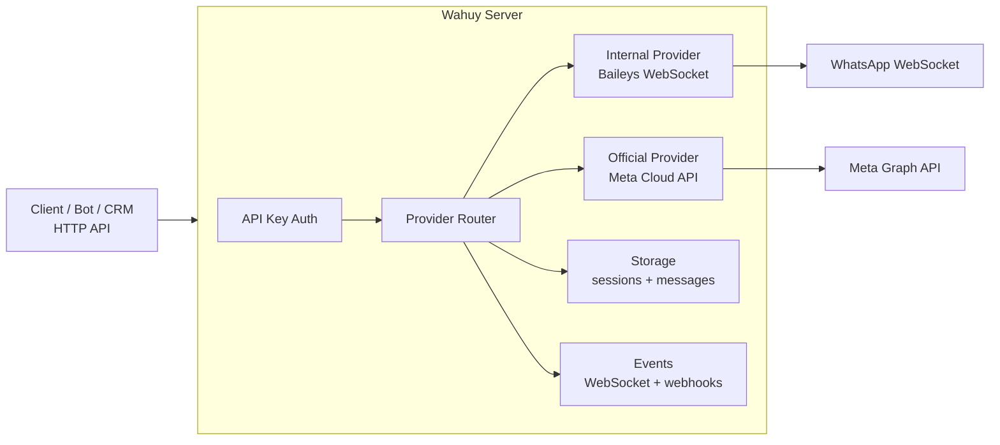

# Wahuy — Self-Hosted WhatsApp API Gateway

**Production-ready WhatsApp API server with multi-session Baileys provider, Official WhatsApp Cloud API proxy mode, webhooks, WebSocket events, persistent message history, and a built-in dashboard.** Built with Fastify, TypeScript, SQLite, Socket.IO, and React.

```text
Build me a WhatsApp automation/integration using Wahuy, start with https://raw.githubusercontent.com/utsmannn/wahuy/main/docs/AI_AGENT_PROMPT.md
```

---

## What Wahuy Does



**Wahuy is the middle layer.** Apps call simple HTTP endpoints. Wahuy handles WhatsApp sessions, provider routing, message sending, media, realtime events, webhook forwarding, and persistence.

**Key difference from calling Meta directly:** Wahuy can run in either unofficial multi-session QR mode for fast automation, or Official Cloud API proxy mode for production WABA integrations. Internal mode uses Baileys — a direct WebSocket-based library — so no Chromium/Puppeteer needed. Baileys identifiers are preserved as message identity; Wahuy fills `contacts.*.number` only from trusted Baileys phone mapping and `contacts.*.profilePicUrl` only when WhatsApp allows profile-photo access.

### Core Features

| Feature | What it does |
|---------|-------------|
| **Dual Provider Mode** | Switch between Internal (Baileys) and Official (WhatsApp Cloud API/WABA). |
| **Multi-Session** | Manage many WhatsApp numbers from one server in Internal mode. |
| **Cloud API Proxy** | Meta-compatible `/v1/messages`, `/v1/media`, `/v1/groups`, `/webhooks/whatsapp`. |
| **Messaging** | Text, image, document, location, reply, typing, recording, read receipts. |
| **Events** | WebSocket push + outbound webhooks with HMAC signature + REST history. |
| **Persistence** | Session auth files + SQLite message and webhook logs under `data/`. |
| **Dashboard** | Built-in React dashboard with realtime QR pairing, session manager, provider switcher, and message viewer. |
| **Contact Metadata** | Preserves Baileys LID identity while adding trusted phone numbers and profile photo URLs when Baileys/WhatsApp provides them. |
| **Small Image** | Only ~350MB Docker image — no Chromium needed. |

---

## Provider Modes

| Mode | Provider | Auth | Notes |
|------|----------|------|-------|
| **Internal** | Baileys (WebSocket) | QR scan | Lightweight, no browser. Account ban risk exists. |
| **Official** | Meta Cloud API | Access token | Legitimate WABA. Requires Meta Business setup. |

---

## Quick Start

### Prerequisites

- Node.js 20+
- Docker & Docker Compose for container deployment
- Meta WhatsApp Business credentials only if using Official mode

### Option 1: Docker

```bash
docker run -d \
  --name wahuy \
  -p 7836:7834 \
  -e API_KEY=your-secure-api-key \
  -e DASHBOARD_ENABLED=true \
  -v wahuy_data:/app/data \
  ghcr.io/utsmannn/wahuy:latest

curl http://localhost:7836/api/health
```

Or use the included compose file:

```bash
API_KEY=your-secure-api-key docker compose up -d
curl http://localhost:7836/api/health
```

> The included `docker-compose.yml` maps host `${WAHUY_PUBLIC_PORT:-7836}` → container `7834`. Docker image is ~350MB.

### Option 2: Local Development

```bash
npm install
cp .env.example .env
npm run build
npm start

# dev mode
npm run dev
```

Open **http://localhost:7836** for the dashboard when `DASHBOARD_ENABLED=true`.

---

## API at a Glance

**Internal API base:** `http://<host>:7836/api`
**Official API base:** `http://<host>:7836/v1`
**Auth:** `X-API-Key: <API_KEY>` except Meta webhook verification at `/webhooks/whatsapp`.

| Group | Key endpoints |
|-------|--------------|
| Health | `GET /api/health` · `GET /api/health/ready` · `GET /api/health/live` |
| Provider | `GET /api/provider` · `POST /api/provider/switch` · `POST /api/provider/test` |
| Sessions | `GET/POST /api/sessions` · `POST /api/sessions/:id/start` · `GET /api/sessions/:id/qr` · `POST /api/sessions/:id/stop` |
| Business | `GET /api/sessions/:id/business/catalog` |
| Internal Messages | `POST /api/sessions/:id/messages/send` · `/send-image` · `/send-document` · `/reply` · `POST /typing` · `POST /read` · `GET /messages/:messageId/media` |
| History | `GET /api/sessions/messages/history` · `GET /api/sessions/:id/conversations/:phone` · `GET /api/sessions/messages/stats` |
| Webhooks | `GET/POST /api/webhooks` · `PUT/DELETE /api/webhooks/:id` · `POST /api/webhooks/:id/test` · `GET /api/webhooks/logs` |
| Official API | `POST /v1/messages` · `GET/POST /v1/media` · `GET/POST/PATCH/DELETE /v1/groups` |
| Meta Webhook | `GET/POST /webhooks/whatsapp` |

**Full integration guide for AI agents:** [`docs/AI_AGENT_PROMPT.md`](docs/AI_AGENT_PROMPT.md)

---

## Common Flows

### Internal mode — create session, scan QR, send message

```bash
# Create a session
curl -X POST http://localhost:7836/api/sessions \
  -H "X-API-Key: <key>" \
  -H "Content-Type: application/json" \
  -d '{"id":"main","name":"Main WhatsApp"}'

# Start the session and get QR
curl -X POST http://localhost:7836/api/sessions/main/start -H "X-API-Key: <key>"
curl http://localhost:7836/api/sessions/main/qr -H "X-API-Key: <key>"
# → returns { "success": true, "data": { "qr": "data:image/png;base64,..." } }

# If an Internal session is stuck in failed because its saved Baileys auth state is invalid,
# force a fresh QR login by clearing that session auth before starting:
curl -X POST http://localhost:7836/api/sessions/main/start \
  -H "X-API-Key: <key>" \
  -H "Content-Type: application/json" \
  -d '{"resetAuth":true}'

# Poll until ready
curl http://localhost:7836/api/sessions/main/status -H "X-API-Key: <key>"

# Send text
curl -X POST http://localhost:7836/api/sessions/main/messages/send \
  -H "X-API-Key: <key>" \
  -H "Content-Type: application/json" \
  -d '{"to":"6281234567890","text":"Hello from Wahuy"}'
```

### Official mode — send Cloud API-compatible message

```bash
curl -X POST http://localhost:7836/v1/messages \
  -H "X-API-Key: <key>" \
  -H "Content-Type: application/json" \
  -d '{
    "messaging_product":"whatsapp",
    "to":"6281234567890",
    "type":"text",
    "text":{"body":"Hello from Wahuy Official mode"}
  }'
```

### Read WhatsApp Business catalog

For a ready Internal session, fetch the connected account's WhatsApp Business catalog read-only:

```bash
curl "http://localhost:7836/api/sessions/main/business/catalog?limit=10" \
  -H "X-API-Key: <key>"
```

Response shape:

```json
{
  "success": true,
  "data": {
    "products": [
      {
        "id": "product-id",
        "name": "Product name",
        "description": "Description",
        "retailerId": "SKU-001",
        "currency": "IDR",
        "price": 100000,
        "salePrice": 80000,
        "discountPrice": 80000,
        "images": ["https://..."],
        "imageProxyUrls": ["/api/sessions/main/business/catalog/images/<signed-token>"],
        "url": "https://...",
        "isHidden": false,
        "availability": "in stock"
      }
    ],
    "count": 1,
    "nextPageCursor": null
  }
}
```

No catalog/non-business catalog state returns `200` with `data.products: []` and `count: 0`. The endpoint defaults to `limit=10` because some WhatsApp Web catalog queries with `limit=100` can be slow or return an empty page; pass `limit`, `cursor`, and `refresh=true` as needed. `images` contains the raw WhatsApp CDN URLs, while `imageProxyUrls` contains signed Wahuy URLs that download the images using browser-like headers, cache them locally on disk in `/app/data/media/catalog/:sessionId/`, and stream them inline. This avoids CDN signature/IP-binding mismatch issues and `file.enc` download headers. Missing sessions return `404 SESSION_NOT_FOUND`; sessions that are not ready return `400 SESSION_NOT_READY`.

### Register an outbound webhook

**Important:** The `sessions` field is **required** — use `["*"]` for all sessions or specify session IDs. Empty sessions are rejected.

```bash
curl -X POST http://localhost:7836/api/webhooks \
  -H "X-API-Key: <key>" \
  -H "Content-Type: application/json" \
  -d '{
    "url":"https://example.com/webhook",
    "events":["message.received","message.sent","session.ready"],
    "sessions":["main"],
    "secret":"optional-hmac-secret"
  }'

# Or to listen to ALL sessions:
# "sessions":["*"]
```

---

## Three Ways to Receive Events

Wahuy provides three independent event channels — pick the ones that fit your architecture:

| Channel | Protocol | Best for |
|---------|----------|----------|
| **WebSocket** | Socket.IO persistent connection | Bots, dashboards, realtime apps |
| **REST History** | HTTP GET polling | Cron jobs, reports, backups |
| **Outbound Webhooks** | HTTP POST to your URL | Serverless functions, Zapier, external logging |

You do **not** need to use webhooks to receive events. WebSocket and REST cover most use cases. Webhooks are ideal when your receiver can't maintain a persistent connection.

### Indicators and received media

- Typing indicator: `POST /api/sessions/:id/typing` with `{ "to": "6281234567890", "duration": 3000 }`.
- Read indicator: `POST /api/sessions/:id/read` with at least `{ "messageId": "..." }`. Wahuy uses the stored Baileys message key when available; callers can also pass `chatId`/`remoteJid` and `participant` explicitly.
- Internal received media: incoming events/history include media metadata when present. Download the base64 payload with `GET /api/sessions/:id/messages/:messageId/media`. Media download needs the raw Baileys media message saved at receive/send time, so it works for media messages stored after this raw-data persistence fix; older rows that only contain normalized metadata cannot be backfilled.
- Official received media: use the existing Cloud API-compatible `GET /v1/media/:mediaId` endpoint.
- Contact profile photos: Internal-mode message contacts include `contacts.*.profilePicUrl` when Wahuy already has a cached Baileys profile-photo URL for that participant/contact. Missing values are `null`; Wahuy fetches photos in the background so incoming message delivery is not delayed.

### WebSocket Events

```js
import { io } from 'socket.io-client';

const socket = io('http://localhost:7836', {
  auth: { apiKey: '<key>' }
});

socket.emit('subscribe', { sessions: ['*'] });
socket.on('session:qr', console.log);      // QR data URL for pairing
socket.on('session:status', console.log);  // scan_qr, ready, disconnected, failed, etc.
socket.on('message:received', console.log);
socket.on('message:sent', console.log);
```

When a pairing QR is generated, Wahuy emits both `session:status` with `status: "scan_qr"` and `session:qr`. The dashboard uses these realtime events to show/update the QR modal without manual refresh. REST `GET /api/sessions/:id/qr` remains available as a fallback.

`session:status` keeps the original `sessionId` and `status` fields. It can also include additive diagnostic fields such as `reason`, `lastError`, and `reconnect` so realtime consumers can explain failed starts without polling REST status:

```json
{
  "sessionId": "main",
  "status": "failed",
  "reason": "Max reconnect attempts exceeded",
  "lastError": {
    "code": "CONNECT_FAILED",
    "message": "...",
    "timestamp": "2026-01-15T10:30:00.000Z"
  },
  "reconnect": {
    "enabled": true,
    "attempts": 5,
    "maxAttempts": 5,
    "nextAttemptAt": null,
    "lastAttemptAt": "2026-01-15T10:29:55.000Z"
  }
}
```

Clients should ignore unknown fields for forward compatibility. REST `GET /api/sessions/:id/status` returns the same failure diagnostics for polling/debugging. REST `POST /api/sessions/:id/start` also returns the full session info object. If Baileys reports `401`/logged-out, Wahuy marks that saved auth state invalid and the next start automatically clears it so the session can pair again with a fresh QR. Pass `{ "resetAuth": true }` only when you intentionally want to force-delete that session's saved Baileys auth files before starting.

### Message Contact Metadata

Internal-mode messages may use Baileys v7 LID identifiers such as `12345@lid`. Wahuy keeps those identifiers in `from`, `to`, and `contacts.*.id` so callers can track the exact WhatsApp identity. Treat them as opaque IDs, not phone-number strings.

Phone numbers are exposed only in `contacts.*.number` when Baileys explicitly provides trusted metadata via `remoteJidAlt`, `participantAlt`, `senderPn`, contact sync, history sync, `lid-mapping.update`, or the Baileys mapping store. If no mapping exists yet, `contacts.*.number` is `null` instead of a fake number derived from the visible identifier. `contacts.*.profilePicUrl` is best-effort cached metadata: it can be `null` on the first event for a contact while Wahuy fetches the photo in the background, then appear on later events when cached.

### Webhook Payload Format

```json
{
  "event": "message.received",
  "timestamp": "2026-01-15T10:30:00.000Z",
  "session": { "id": "main", "phone": null },
  "payload": {
    "id": "BAE5...",
    "from": "12345@lid",
    "body": "Hello!",
    "type": "chat",
    "fromMe": false,
    "hasMedia": false,
    "contacts": {
      "sender": {
        "id": "12345@lid",
        "number": "6281234567890",
        "pushname": "Jane",
        "profilePicUrl": "https://mmg.whatsapp.net/..."
      },
      "receiver": {
        "id": "98765@lid",
        "number": "6289876543210"
      }
    }
  }
}
```

### Webhook Security Model

- **`sessions` is mandatory** — webhook without sessions is rejected (400).
- **`["*"]`** — receive events from all sessions.
- **`["main", "secondary"]`** — only receive events from specific sessions.
- **Legacy webhooks** with empty sessions are auto-migrated to `["*"]` on startup (backward compatible).
- **HMAC signature** optional via `secret` — set it and verify `X-Webhook-Signature` header.

---

## Configuration

All env vars with defaults are in [`.env.example`](.env.example) and [`src/config.ts`](src/config.ts).

| Variable | Default | Notes |
|----------|---------|-------|
| `PORT` | `3000` | Container HTTP port; Docker examples publish it on host port `7836`. |
| `API_KEY` | `development-api-key` | **Change in production.** |
| `API_KEYS` | — | Optional comma-separated extra API keys. |
| `PROVIDER` | `internal` | `internal` or `official`. |
| `DASHBOARD_ENABLED` | `true` | Serve built dashboard at `/`. |
| `STORAGE_PATH` | `./data` | Sessions, message DB, webhook logs. |
| `SESSION_RECONNECT_INTERVAL` | `5000` | Reconnect backoff base (ms). |
| `SESSION_MAX_RECONNECT_ATTEMPTS` | `10` | Max auto-reconnect attempts. |
| `OFFICIAL_ACCESS_TOKEN` | — | Required for Official mode. |
| `OFFICIAL_APP_SECRET` | — | Required for Meta webhook signatures. |
| `OFFICIAL_PHONE_NUMBER_ID` | — | Required for Official mode. |
| `OFFICIAL_WEBHOOK_VERIFY_TOKEN` | — | Required for Meta webhook verification. |
| `REDIS_URL` | — | Optional queue backend for Official mode. |

---

## Project Structure

```text
wahuy/
├── src/
│   ├── api/                    # REST API routes and auth middleware
│   ├── providers/              # Internal (Baileys) + Official implementations
│   ├── core/                   # Session manager, WhatsApp client, webhook dispatcher
│   ├── storage/                # File/SQLite storage
│   ├── websocket/              # Socket.IO event bridge
│   └── utils/                  # Logging and helpers
├── dashboard/                  # React dashboard (Vite)
├── docs/                       # AI agent guide
├── docker/                     # Docker image files (no Chromium)
├── data/                       # Runtime data volume
└── tests/                      # Unit/integration tests
```

---

## Development

```bash
npm run dev              # hot reload server
npm run build            # TypeScript build
npm test                 # all tests
npm run lint             # ESLint
npm run dashboard:dev    # dashboard dev server
npm run dashboard:build  # dashboard production build
```

---

## Production Checklist

- [ ] Set a strong `API_KEY` or `API_KEYS`
- [ ] Change `DASHBOARD_USERNAME` and `DASHBOARD_PASSWORD`
- [ ] Set `PORT`, `NODE_ENV=production`, and `STORAGE_PATH`
- [ ] Mount persistent storage for `data/`
- [ ] Put Wahuy behind HTTPS if exposed publicly
- [ ] Use Official mode for production messaging when WABA is available
- [ ] Always set `sessions` on outbound webhooks — use `["*"]` or specific IDs
- [ ] Configure webhook secrets and validate signatures on your receiver
- [ ] Back up `data/` regularly

---

## Docs Index

| Doc | Contents |
|-----|----------|
| [`docs/AI_AGENT_PROMPT.md`](docs/AI_AGENT_PROMPT.md) | AI agent guide: install, configure, API exploration, integration flows. |
| [`.env.example`](.env.example) | Environment variable starter file. |
| [`src/config.ts`](src/config.ts) | Canonical config defaults. |
| [`src/api/index.ts`](src/api/index.ts) | Route registration and prefixes. |

---

## Security Note

Wahuy is not affiliated with WhatsApp Inc. or Meta Platforms Inc. Internal mode uses unofficial WhatsApp WebSocket automation via Baileys and may violate WhatsApp policies. Official mode uses Meta's WhatsApp Cloud API.

## License

MIT
